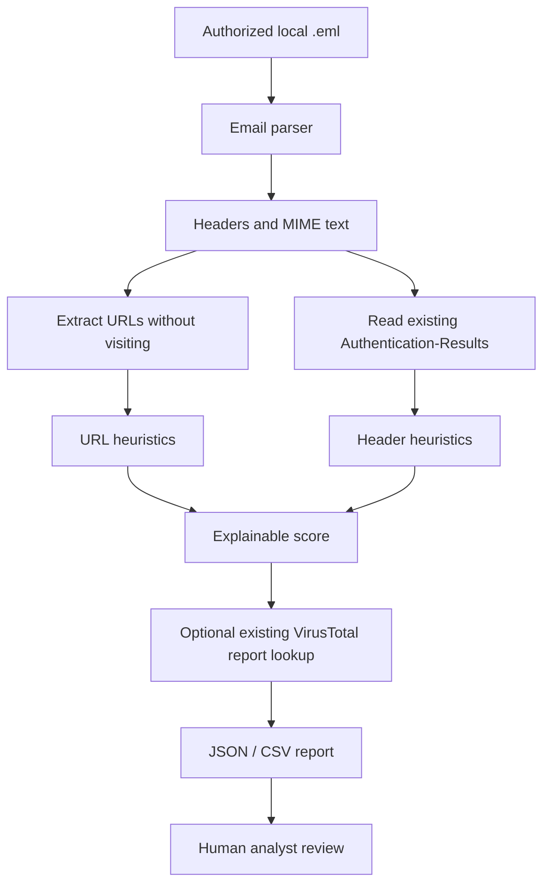

# Architecture

```mermaid
flowchart TD
 A[Authorized local .eml] --> B[Email parser]
 B --> C[Headers and MIME text]
 C --> D[Extract URLs without visiting]
 C --> E[Read existing Authentication-Results]
 D --> F[URL heuristics]
 E --> G[Header heuristics]
 F --> H[Explainable score]
 G --> H
 H --> I[Optional existing VirusTotal report lookup]
 I --> J[JSON / CSV report]
 J --> K[Human analyst review]
```

Headers and messages are untrusted. URL lookups share data with a third party and are disabled by default.
